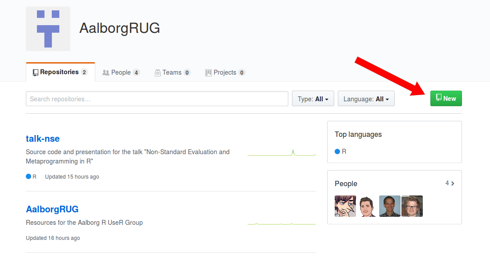
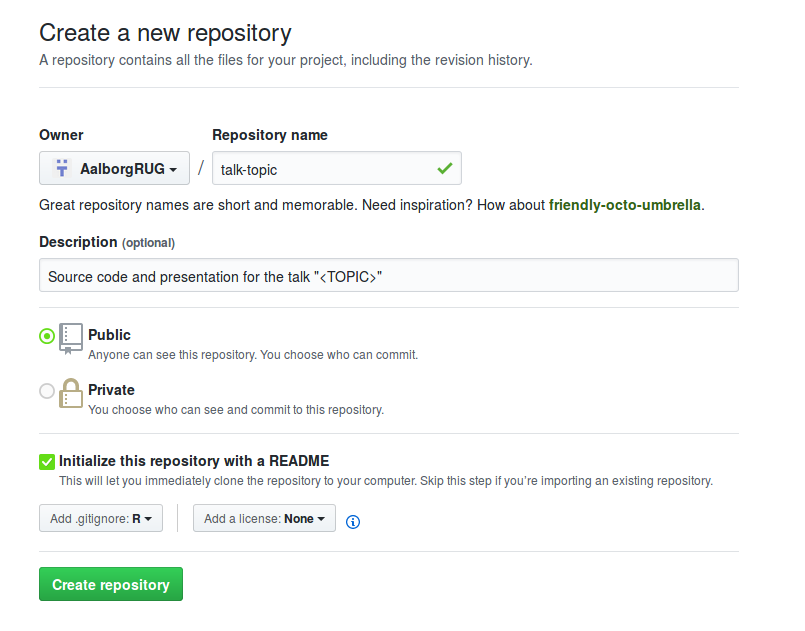
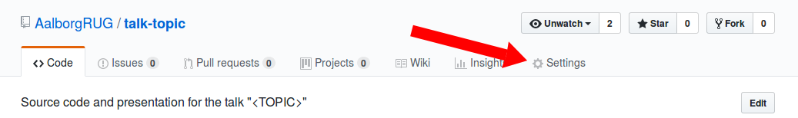
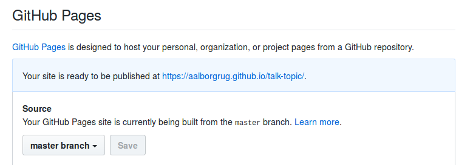
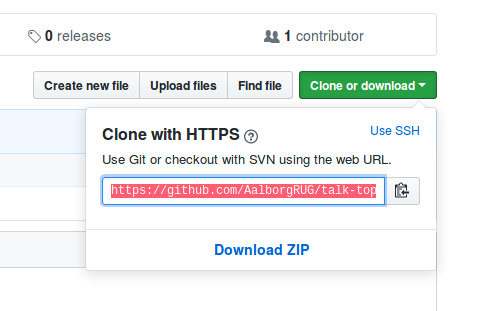
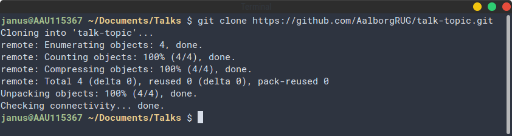
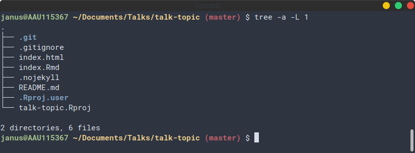
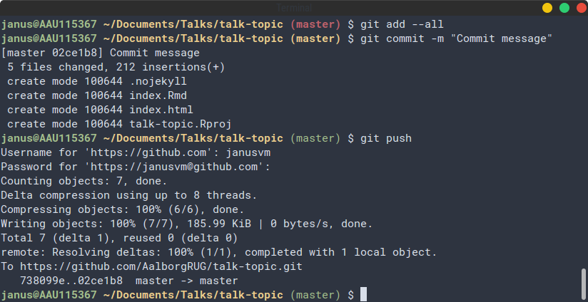
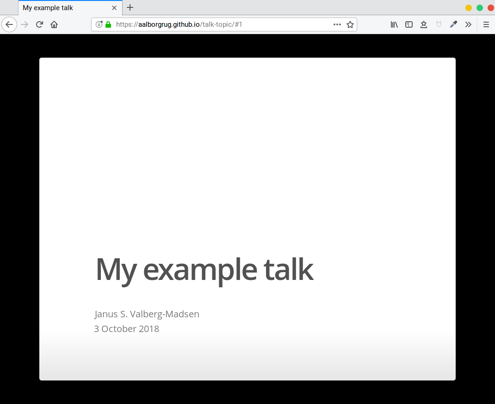

<!-- hosting.md is generated from hosting.Rmd. Please edit that file -->

```{r setup, include=FALSE}
knitr::opts_chunk$set(echo = TRUE)
```

GitHub Pages is a service offered by GitHub that lets you host a website for free directly from a GitHub repository.
This can be used to let people view your slides directly in their browser, see [my talk on metaprogramming](https://aalborgrug.github.io/talk-nse) for a live example.

This guide will outline how to set it up.


## Prerequisites

- Be a member of the [AalborgRUG GitHub organisation](https://github.com/AalborgRUG) (contact [Ege](mailto:rubak@math.aau.dk) to request membership, include your GitHub account name in the email)
- Have [git](https://git-scm.com/) installed
- A framework that lets you create slides in HTML format (ioslides, slidy, xaringan, etc.)


## Step 1: create repository for your talk

Go to the organisation overview page and click the **New** button.



Give your repo an appropriate name and description.
You can have it be either Public or Private, but unless it is going to include sensitive or licensed data, consider leaving it public (in the spirit of open source `r emo::ji("wink")`)




## Step 2: Enable GitHub Pages for your repo

Go to **Settings**.



Scroll down to GitHub Pages, select **master branch** from the dropdown menu, and click **Save**.




## Step 3: clone repository to your computer

Click the **Clone or download** button and copy the link.



Clone it to your computer with `git clone`.




## Step 4: create your slides

Create your HTML slides in the root directory of the repo.

For GitHub Pages to correctly acknowledge and use your slides as the page contents,

- the slides must have the filename **index.html**
- an empty file with the filename **.nojekyll** must be created in the repo root

By default, GitHub Pages uses the Jekyll framework to render a page, but since all we need is included in the slide files already, the points above disable Jekyll and make GitHub load content as-is from index.html.

You should (at least) have the following files in your repo:




## Step 5: commit and push

To get the site online, you simply commit and push to the remote.



In this example, I included everything, but as long as you push all the files that are used by index.html and .nojekyll, the slides should render correctly.


## Step 6: access live site

After pushing, your slides will be live at `https://aalborgrub.github.io/<repo-name>`.


